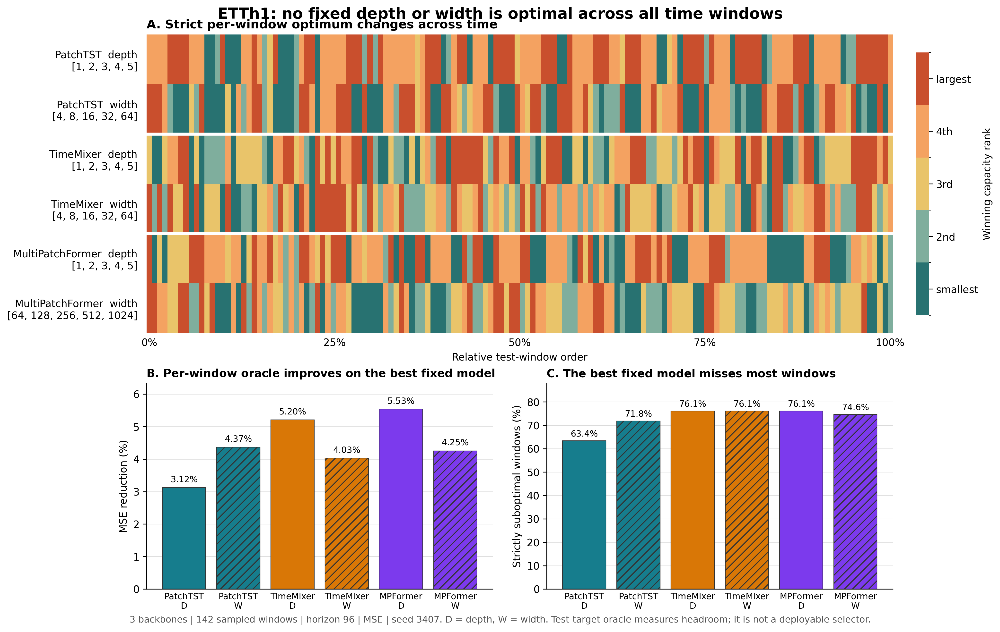

# ETTh1 模型深度/宽度预实验报告

## 实验协议

- 数据集：ETTh1
- 模型：PatchTST（2023）、TimeMixer（2024）、MultiPatchFormer（2025）
- 输入/预测长度：96/96
- 种子：3407
- 训练：最多 100 epochs，batch size 64，early-stopping patience 10
- 优化器参数：learning rate 0.0002，weight decay 0.0005
- 深度候选：每个模型均为 1、2、3、4、5
- 宽度候选：PatchTST 和 TimeMixer 为 4、8、16、32、64；MultiPatchFormer 为 64、128、256、512、1024
- 局部损失：归一化尺度 MSE；测试窗口每隔 24 个样本取一个窗口
- 容量选择：epsilon=0.0，严格选择逐窗口平均 MSE 最小的候选，损失相同时选择较小容量

共完成 30/30 个训练 run，无失败。所有 run 均保存了形状为 `(3389, 96, 7)` 的输入、预测和目标数组。训练累计墙钟时间约 6.68 小时，记录到的最大训练 CUDA 分配约 1152 MiB。

## 数据覆盖

`local_losses.csv` 共 29,820 行，覆盖：

- 3 个模型，每个模型 9,940 行；
- 每个模型的深度轴和宽度轴各 4,970 行；
- 142 个采样窗口、7 个通道、5 个候选容量、1 个种子；
- `loss_mae` 和 `loss_mse` 均无缺失值。

`model_capacity_trajectories.csv` 共 852 行，即 3 个模型 x 2 个容量轴 x 142 个窗口。

## 整体测试指标

以下是每个模型在各单轴扫描中的最低整体测试 MSE。整体 MSE 仅用于描述；主实验结论来自逐窗口 oracle 容量轨迹。

| 模型 | 深度轴最低 MSE（深度） | 宽度轴最低 MSE（d_model） |
|---|---:|---:|
| PatchTST | 0.460978（5） | 0.454186（64） |
| TimeMixer | 0.441180（3） | 0.441944（8） |
| MultiPatchFormer | 0.447153（1） | 0.447135（128） |

## 固定容量不能达到逐片段最优

对模型的一个容量轴（深度或宽度），记第 `t` 个测试窗口在候选容量 `c` 下的平均 MSE 为
`L_t(c)`。在全部 142 个窗口上事后选择的最佳固定容量及逐窗口 oracle 分别为：

```text
最佳固定容量：c_fixed = argmin_c (1/T) sum_t L_t(c)
逐窗口 oracle：L_oracle = (1/T) sum_t min_c L_t(c)
```

如果某个固定容量能在所有片段上同时取得最优，那么它的平均损失必然等于逐窗口 oracle。
实际六组扫描均观察到严格不等式：

```text
min_c (1/T) sum_t L_t(c) > (1/T) sum_t min_c L_t(c)
```

因此，在本实验评估的 ETTh1 测试窗口和候选容量集合内，不存在一个固定深度或固定宽度能够
在所有时间片段上同时取得最低 MSE。具体结果如下：

| 模型 | 容量轴 | 最佳固定容量 | 最佳固定 MSE | 逐窗口 oracle MSE | Oracle 降幅 | 最佳固定容量严格非最优的窗口 |
|---|---|---:|---:|---:|---:|---:|
| PatchTST | 深度 | 5 | 0.465666 | 0.451135 | 3.12% | 90/142（63.4%） |
| PatchTST | 宽度（d_model） | 64 | 0.469579 | 0.449074 | 4.37% | 102/142（71.8%） |
| TimeMixer | 深度 | 3 | 0.444307 | 0.421183 | 5.20% | 108/142（76.1%） |
| TimeMixer | 宽度（d_model） | 16 | 0.444728 | 0.426809 | 4.03% | 108/142（76.1%） |
| MultiPatchFormer | 深度 | 1 | 0.447289 | 0.422533 | 5.53% | 108/142（76.1%） |
| MultiPatchFormer | 宽度（d_model） | 256 | 0.447289 | 0.428258 | 4.25% | 106/142（74.6%） |

这不是由某一个异常模型驱动的结果：三个 Backbone 的深度轴和宽度轴全部存在严格 oracle
差距。六组扫描中，每组的 5 个候选容量都至少在一个窗口上成为严格最优；沿时间顺序观察，
最优容量共切换 66-102 次。即使允许从所有候选中选择“覆盖窗口最多”的单一容量，它最多也
只能覆盖 23.9%-38.0% 的窗口，不能覆盖全部窗口。

由于原始采样步长为 24、预测长度为 96，相邻窗口的预测区间存在重叠。作为稳健性检查，每
4 个窗口仅保留 1 个，得到 36 个预测区间不重叠的窗口。此时最佳固定容量仍在 55.6%-86.1%
的窗口上严格非最优，逐窗口 oracle 的 MSE 降幅仍为 3.27%-6.77%，结论不依赖重叠窗口的
重复计数。



**结论。** 当前结果证明的是一个范围明确的经验命题：ETTh1 的片段级最优容量具有时间异质
性，在已测试的深度/宽度候选中，统一固定容量不能达到逐片段最佳效果。这为动态调整模型深度
和宽度提供了直接的存在性依据。这里的 oracle 使用测试目标，只用于度量可利用的性能上限，
并不等同于已经实现了一个可部署的容量选择器。实验目前只有预测长度 96 和种子 3407，因此
不应外推为“任何数据集、任何随机种子下固定容量永远不可能最优”。

## 逐窗口相关性

| 模型 | U 与最佳深度 Spearman rho | 普通 p | circular-shift p | M 与最佳宽度 Spearman rho | 普通 p | circular-shift p |
|---|---:|---:|---:|---:|---:|---:|
| PatchTST | -0.1578 | 0.0607 | 0.1690 | 0.0383 | 0.6509 | 0.6268 |
| TimeMixer | -0.0175 | 0.8359 | 0.8803 | 0.0355 | 0.6751 | 0.6620 |
| MultiPatchFormer | 0.0448 | 0.5966 | 0.6901 | -0.0098 | 0.9080 | 0.9507 |
| 三模型合并（仅描述） | -0.0372 | 0.4443 | - | 0.0230 | 0.6362 | - |

本次单种子结果不支持“U 越大最佳深度越大”或“M 越大最佳宽度越大”：逐模型方向不一致，效应接近零，且所有 circular-shift 检验均不显著。PatchTST 的深度相关反而为负，普通 p 值接近 0.05，但考虑时间自相关后的 circular-shift p=0.1690，不能视为显著证据。

最佳容量在时间上频繁切换。PatchTST 的深度轨迹有 51.4% 的窗口落在搜索边界，宽度轨迹有 58.5% 落在边界；TimeMixer 对应为 47.9% 和 32.4%，MultiPatchFormer 为 48.6% 和 35.2%。因此这些结果应视为单种子探索性证据，不应解释为已经建立了稳定的动态容量映射。

## 执行步骤

```bash
# 1. 检查 30-run 计划
pixi run model-preexp-plan

# 2. 串行训练 3 个模型 x 2 个轴 x 5 个候选 x 1 个种子
pixi run model-preexp

# 3. 从保存的输入/预测/目标构建对齐的逐窗口损失
pixi run model-preexp-losses

# 4. 严格校验覆盖、选择逐窗口最佳容量并生成图表
pixi run model-preexp-analyze

# 5. 比较最佳固定容量与逐窗口 oracle，生成结论图和统计表
pixi run python pre_experiments/analyze_fixed_capacity.py
```

训练通过独立 `screen` 会话运行，完整终端输出保存在 `training.log`。批量入口会跳过已完成且预测数组齐全的 run，因此相同命令可用于断点续跑。

## 输出文件

- `runs/`：30 个 run 的 manifest、checkpoint、指标和测试数组
- `training.log`：完整训练日志
- `local_losses.csv`：逐模型、轴、容量、窗口和通道的 U/M、MAE、MSE
- `model_capacity_trajectories.csv`：逐模型、窗口和轴的最佳容量轨迹
- `model_capacity_correlations.json`：相关系数及 p 值
- `model_capacity_temporal_trajectories.pdf`：U/M 与最佳深度/宽度的六面板时序图
- `fixed_capacity_gap.csv`：最佳固定容量、逐窗口 oracle、覆盖率与非重叠窗口稳健性统计
- `fixed_capacity_vs_oracle.pdf`：固定容量不足结论图（论文排版版本）
- `fixed_capacity_vs_oracle.png`：固定容量不足结论图（文档预览版本）
